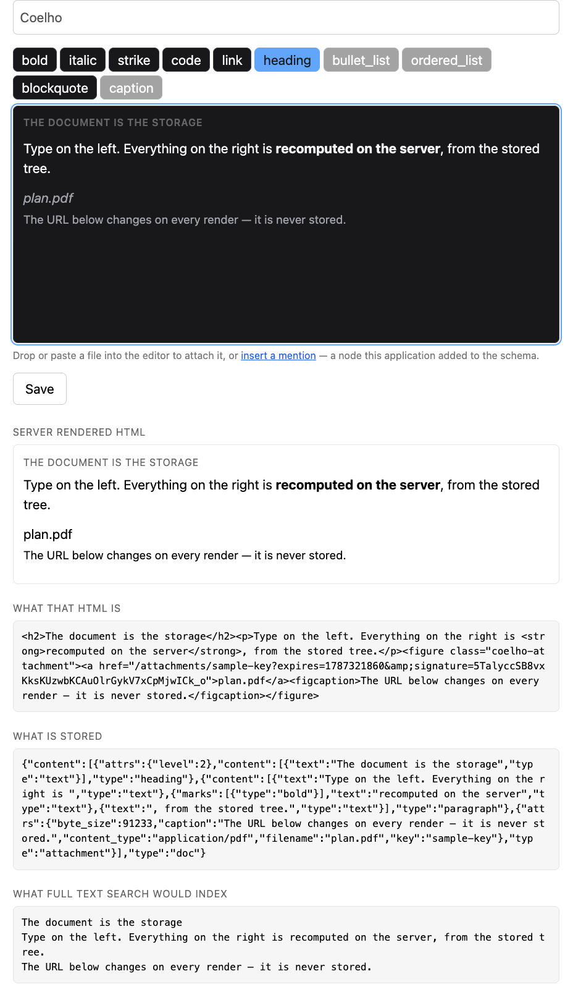

# Coelho demo

A single page showing what storing the document instead of the HTML buys you.



Type on the left. Everything on the right is recomputed on the server, from
the stored tree, on every keystroke:

- the **rendered HTML** and its source,
- **what is actually stored** — a validated JSON document, no markup,
- **what full text search would index**,
- the **schema violations**, straight off the changeset.

The attachment in the sample document shows the other half of the argument:
its URL carries an expiry that moves on every render, because the document
stores a key and the URL is resolved each time.

Drop or paste a file into the editor and the whole attachment path runs:
the bytes go up through LiveView's upload channel into
`Coelho.Storage.Disk`, the document gets a key, and the rendered HTML on the
right carries a signed URL that `Coelho.Plug.Attachments` serves — and that
expires five minutes after each render.

## Running it

```
mix setup
mix phx.server
```

Then open http://localhost:4321 — or whichever port it announces on the way
up. If 4321 is taken, [AutoPort](https://hex.pm/packages/autoport) steps to
the next free one and says so:

```
Port 4321 is in use, using 4322
```

Set `PORT` to decide it yourself. That wins outright, which is what
`docker/check.sh` relies on: it sets `PORT` and then points the browser
checks at `http://localhost:$PORT`, so a port that moved on its own would
leave them waiting on an address nothing is listening to. AutoPort is asked
only when nobody has said, and only in development — it checks a port and
then binds it, and the gap between the two is a race nothing should depend on
anywhere else.

There is **no database**. Coelho stores the document in the row that owns it,
so the demo gets away with an `embedded_schema` and a changeset — that is the
whole persistence story.

## Checking that a person can actually type in it

No Elixir test can establish that. `test/browser/editor.mjs` drives a real
browser against a running instance and checks the things only a browser
knows: that the editor mounts, that typing reaches the document *and* the
server, that the caret survives a round trip and a slow echo does not roll
the writer back, that the toolbar and the keyboard apply marks and the
toolbar says what is in force, that dropping a file stores it and serves the
bytes back through a signed URL, and that an image pasted from another host
is captured rather than hotlinked.

It runs against all three engines, because `contenteditable` and selection
are where they disagree — which is where every bug this suite has found was
hiding.

```
npx playwright install chromium firefox webkit
mix phx.server &
npm run test:browsers            # or BROWSER=webkit npm run test:browser
```

Locally that runs the engines as they are on *this* machine, which is not how
CI sees them. To run them as CI does, use the image:

```
docker compose -f ../docker/compose.yml run --rm --build browsers
```

## Checking that both halves agree

The schema is declared in Elixir and exported to the browser, but `toDOM` and
`parseDOM` are functions and live in `assets/js/coelho.js`. That file is the
only place the two halves can drift. Two checks cover it:

- in the library, `test/coelho/schema_drift_test.exs` compares the names,
- here, the bridge check feeds the real exported JSON to the real browser
  code and builds an actual ProseMirror schema:

```
mix run priv/check/export_schemas.exs /tmp/schema.json /tmp/doc.json /tmp/extended.json
node priv/check/schema_bridge.mjs /tmp/schema.json /tmp/doc.json /tmp/extended.json
```

The third schema is an application's: marks the library has never heard of,
one declaring how it looks and one saying nothing at all. Both have to build
an editor — the second by falling back, out loud.

## Notes on the setup

- npm packages are installed at the app root rather than under `assets/`, and
  `config/config.exs` adds that directory to esbuild's `NODE_PATH`. Coelho's
  hook lives outside the app and imports ProseMirror by bare specifier; Node
  resolution walks up from the *importing* file, which otherwise never
  reaches this app's `node_modules`.
- `import {Coelho} from "../../../assets/js/coelho.js"` reaches into the
  checkout above, because a path dependency is not copied into `deps/`. An
  application depending on Coelho from Hex writes
  `"../../deps/coelho/assets/js/coelho.js"`.
- daisyUI was removed from `assets/css/app.css`: the vendored build shipped by
  the generator does not accept options under Tailwind 4.1.12, and this page
  is plain CSS anyway.
